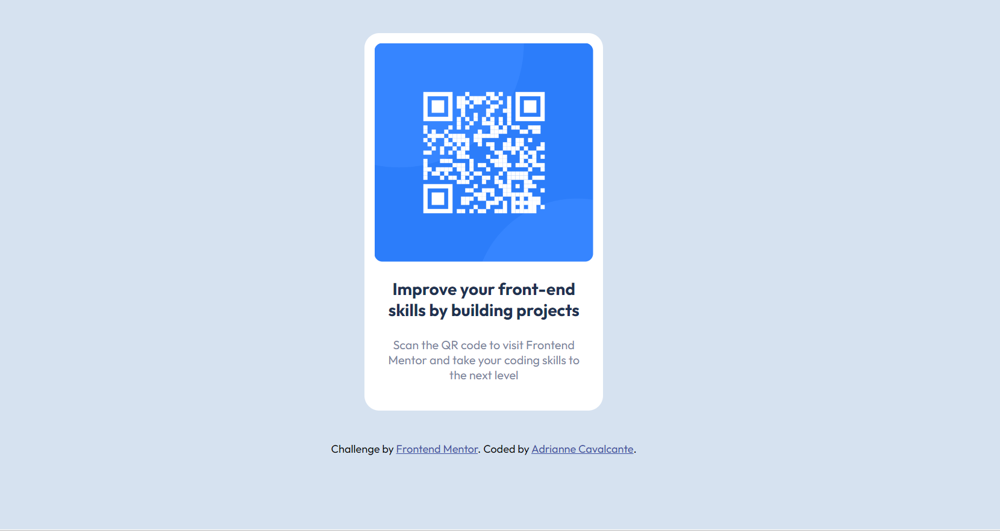

# Frontend Mentor - QR code component solution

This is a solution to the [QR code component challenge on Frontend Mentor](https://www.frontendmentor.io/challenges/qr-code-component-iux_sIO_H). Frontend Mentor challenges help you improve your coding skills by building realistic projects. 


## Table of contents

- [Overview](#overview)
  - [Screenshot](#screenshot)
  - [Links](#links)
- [My process](#my-process)
  - [Built with](#built-with)
  - [What I learned](#what-i-learned)
  - [Continued development](#continued-development)
  - [Useful resources](#useful-resources)
- [Author](#author)
- [Acknowledgments](#acknowledgments)


## Overview

### Screenshot




### Links

- Solution URL: [Add solution URL here](https://your-solution-url.com)
- Live Site URL: [Add live site URL here](https://your-live-site-url.com)

## My process

### Built with

- Semantic HTML5 markup
- CSS custom properties
- Flexbox
- CSS Grid
- Mobile-first workflow
- [Styled Components](https://styled-components.com/) - For styles


### What I learned

Use this section to recap over some of your major learnings while working through this project. Writing these out and providing code samples of areas you want to highlight is a great way to reinforce your own knowledge.

To see how you can add code snippets, see below:

```html
<h1>Some HTML code I'm proud of</h1>
```
```css
.proud-of-this-css {
  color: papayawhip;
}
```
```js
const proudOfThisFunc = () => {
  console.log('🎉')
}
```


### Continued development

Use this section to outline areas that you want to continue focusing on in future projects. These could be concepts you're still not completely comfortable with or techniques you found useful that you want to refine and perfect.

**Note: Delete this note and the content within this section and replace with your own plans for continued development.**

### Useful resources

- [Example resource 1](https://www.example.com) - This helped me for XYZ reason. I really liked this pattern and will use it going forward.
- [Example resource 2](https://www.example.com) - This is an amazing article which helped me finally understand XYZ. I'd recommend it to anyone still learning this concept.

**Note: Delete this note and replace the list above with resources that helped you during the challenge. These could come in handy for anyone viewing your solution or for yourself when you look back on this project in the future.**

## Author

- Website - [Add your name here](https://www.your-site.com)
- Frontend Mentor - [@yourusername](https://www.frontendmentor.io/profile/yourusername)
- Twitter - [@yourusername](https://www.twitter.com/yourusername)

**Note: Delete this note and add/remove/edit lines above based on what links you'd like to share.**

## Acknowledgments

This is where you can give a hat tip to anyone who helped you out on this project. Perhaps you worked in a team or got some inspiration from someone else's solution. This is the perfect place to give them some credit.

**Note: Delete this note and edit this section's content as necessary. If you completed this challenge by yourself, feel free to delete this section entirely.**


# Mentor de frontend - solução de componente de código QR 

 Esta é uma solução para o [QR Code Component Challenge no Frontend Mentor] (https://www.frontendmentor.io/challenges/qr-code-component-iux_sio_h). Os desafios do mentor do front -end ajudam a melhorar suas habilidades de codificação, construindo projetos realistas. 


 ## Índice 

 - [Visão geral] (#Visão geral) 
   - [Screenshot] (#screenshot) 
   - [links] (#links) 
 - [meu processo] (#meu processo) 
   - [construído com] (#construído-with) 
   -[o que aprendi] (#o que eu apreciei) 
   - [Desenvolvimento Continuado] (#Continuação de Desenvolvimento) 
   - [Recursos úteis] (#UVELSOURCES) 
 - [Autor] (#autor) 
 - [Agradecimentos] (#Agradecimentos) 


 ## Visão geral 

 

 Links ### 

 -Solução URL: [Adicione URL da solução aqui] (https://your-solution-url.com) 
 -URL do site ao vivo: [Adicione URL do site ao vivo aqui] (https://your-live-site-url.com) 

 ## meu processo 

 ### construído com 

 - marcação semântica HTML5 
 - Propriedades personalizadas do CSS 
 - Flexbox 
 - grade CSS 
 - Fluxo de trabalho para celular primeiro 

 - [componentes com estilo] (https://styled-coploments.com/) - para estilos 

 ** Nota: esses são apenas exemplos. Exclua esta nota e substitua a lista acima por suas próprias opções ** 

 ### O que eu aprendi 

 Use esta seção para recapitular alguns de seus principais aprendizados enquanto trabalha nesse projeto. Escrever isso e fornecer amostras de código de áreas que você deseja destacar é uma ótima maneira de reforçar seu próprio conhecimento. 

 Para ver como você pode adicionar trechos de código, veja abaixo: 

 `` `html 
 <H1> Algum código html tenho orgulho de </h1> 
 `` ` 
 `` `CSS 
 .proud-of-css { 
   Cor: mamão; 
 } 
 `` ` 
 `` `JS 
 const pouefththisfunc = () => { 
   console.log ('' ') 
 } 
 `` ` 

 Se você quiser mais ajuda para escrever o Markdown, recomendamos verificar [o guia de marcação] (https://www.markdownguide.org/) para saber mais. 

 ** Nota: Exclua esta nota e o conteúdo desta seção e substitua seus próprios aprendizados. ** 

 ### Desenvolvimento contínuo 

 Use esta seção para delinear as áreas nas quais você deseja continuar se concentrando em projetos futuros. Estes podem ser conceitos que você ainda não está completamente confortável ou técnicas que você achou úteis que deseja refinar e aperfeiçoar. 

 ** Nota: Exclua esta nota e o conteúdo desta seção e substitua seus próprios planos para o desenvolvimento contínuo. ** 

 ### Recursos úteis 

 - [Exemplo de recurso 1] (https://www.example.com) - Isso me ajudou por XYZ Motivo. Eu realmente gostei desse padrão e o usarei daqui para frente. 
 - [Exemplo de recurso 2] (https://www.example.com) - Este é um artigo incrível que me ajudou a finalmente a entender o XYZ. Eu recomendaria para quem ainda está aprendendo esse conceito. 

 ** Nota: exclua esta nota e substitua a lista acima por recursos que o ajudaram durante o desafio. Isso pode ser útil para quem veja sua solução ou para si mesmo quando você olha para trás neste projeto no futuro. ** 

 ## Autor 

 - Site - [Adicione seu nome aqui] (https://www.your-site.com) 
 - Frontend Mentor - [@yourusername] (https://www.frontendmentor.io/profile/yourusername) 
 - Twitter - [@yourusername] (https://www.twitter.com/yourusername) 

 ** NOTA: Exclua esta nota e adicione/remova/edite linhas acima com base nos links que você gostaria de compartilhar. ** 


